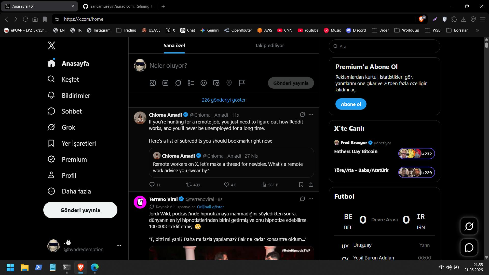
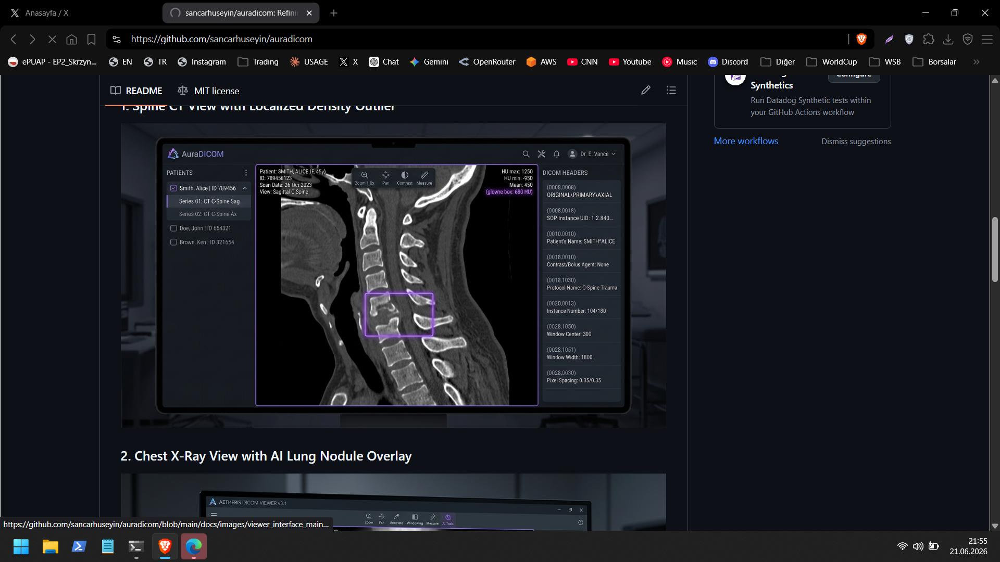

# AuraDICOM - Medical DICOM Image Viewer & Local AI Anomaly Scanner

AuraDICOM is a modern, lightweight, privacy-focused medical DICOM image viewer and diagnostic screening tool. It allows you to parse folders containing local DICOM (`.dcm`, `.dicom`, `.ima`) files, navigate patient study hierarchies, perform interactive viewport operations, inspect metadata tags, and run pixel-level statistical anomaly scans entirely offline.

---

### 🔒 Privacy First: Keep Your Personal Medical Data Local

In the modern medical software landscape, many diagnostic assistants and imaging platforms require uploading patient scans to external cloud servers for processing, rendering, or machine learning analysis. This exposes sensitive personal health information (PHI) to third-party data handlers and potential security breaches.

**AuraDICOM is designed with a strict offline-first philosophy.** 

If you want to view, manage, and scan your DICOM files—your private personal data—**without ever sharing them with a third-party company, cloud vendor, or external API**, AuraDICOM offers the perfect solution. 

* 💻 **100% Self-Hosted**: Every single line of code runs locally on your workstation.
* 🛡️ **Zero Cloud Dependencies**: No external APIs are called, and no telemetry is collected.
* 🤐 **Complete Data Sovereignty**: Your raw patient scans and metadata never leave your local machine.

---

## 📸 Interface Screenshots & Gallery

Here are mockups of the AuraDICOM viewer interface displaying medical scans with local AI-detected anomalies:

### 1. Spine CT View with Localized Density Outlier


### 2. Brain CT Phantom View with AI-Detected Dense Lesion


---

## ✨ Features

* **Left Sidebar (Study Browser)**: Automatically index local scan directories recursively and group them into a clear structure (**Patient ➔ Study ➔ Series ➔ Modality & Slice Count**). Includes instant search filtering.
* **Interactive Viewport (Center Canvas)**:
  * ↔️ **Slice Scroll**: Click and drag up/down on the viewport to slide forward and backward through slices, or use the mouse scroll wheel.
  * ☯️ **Dynamic Windowing (WC/WW)**: Click and drag left/right to adjust Contrast (Window Width) and up/down to adjust Brightness (Window Center).
  * 🔍 **Zoom & Pan**: Click and drag to pan the canvas. Hold `Shift` while dragging to zoom in or out.
  * 🖼️ **Cine Playback Loop**: Play back slices in sequence to view scan progression like a movie, with customizable frames-per-second (FPS) control.
* **🧠 Generalized Pixel Anomaly Scanner**: 
  * Run an unsupervised, pixel-level statistical scan of the active series.
  * Identifies localized soft-tissue density outliers, calcifications, lesions, or bone structure alterations by computing deviation metrics from the segmented patient body mask.
  * Draws coordinate-anchored, glowing purple bounding box overlays directly on the anatomy (guaranteeing boxes never land on the background, bed, or empty space).
* **Right Sidebar (DICOM Tag Inspector)**: Browse all pydicom metadata headers in a tabular layout, with instant filter searching by tag name, group ID, or value.
* **Demo CT Scan Generator**: Don't have a DICOM scan on hand? Use the **Generate Demo** header button to synthesize a 30-slice 3D Head CT Phantom scan with an embedded brain parenchyma lesion to test all features instantly.

---

## 🛠️ Technology Stack

* **Backend**: Python 3, Flask, pydicom (header parsing), NumPy (matrix manipulations & windowing), Pillow (image encoding/drawing).
* **Frontend**: Vanilla HTML5, Vanilla CSS3 (dark slate medical theme, PACS overlays, fluid layout), and Vanilla JavaScript (interactive viewport transform matrices, event listeners, CINE playback loops).

---

## 🚀 Quick Start

### 📋 Prerequisites

* Python 3.8 or higher installed on your system.

### 🔌 Running the Server

1. **Activate the Environment**:
   If on Windows, activate the pre-configured virtual environment:
   ```powershell
   .\venv\Scripts\activate
   ```
2. **Start the Flask Server**:
   ```powershell
   python server.py
   ```
3. **Open in Web Browser**:
   Navigate to **`http://localhost:5000`** in any web browser.

Alternatively, you can simply double-click the `run.bat` file in the project root folder to boot up the environment automatically.

---

## ⌨️ Keyboard Shortcuts

Press the <kbd>H</kbd> key in the viewer interface to open the shortcut menu:

| Key | Action |
| --- | --- |
| <kbd>Spacebar</kbd> | Toggle Cine playback loop (Cine Loop) |
| <kbd>←</kbd> / <kbd>↑</kbd> | Previous Slice (Scroll backward) |
| <kbd>→</kbd> / <kbd>↓</kbd> | Next Slice (Scroll forward) |
| <kbd>W</kbd> / <kbd>S</kbd> | Adjust Window Center (WC) +/- (Brightness) |
| <kbd>A</kbd> / <kbd>D</kbd> | Adjust Window Width (WW) +/- (Contrast) |
| `Double Click` | Reset viewport translation (zoom/pan) and windowing to defaults |
| `Mouse Wheel` | Scroll through slices (zooms instead if Zoom/Pan active tool is selected) |

---

## 📄 License

This project is licensed under the permissive [MIT License](LICENSE) - see the LICENSE file for details.
